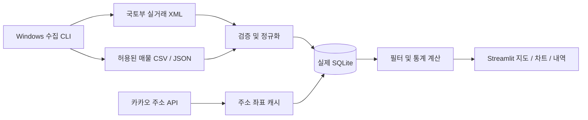

# 한국 부동산 지도 통계 프로젝트 계획서

작성일: 2026-09-19 · 프로젝트명: 집의 흐름 · 1차 범위: 아파트 매매

## 1. 목표와 사용자 경험

한국 아파트 매매 실거래와 현재 관측되는 매물을 수집하고 지도에서 지역별 가격·거래량·호가 차이를 탐색한다.
사용자는 지역을 선택하고 기간·면적·가격으로 좁힌 뒤, 지도 단지를 클릭해 거래 내역과 매물 이력을 확인한다.
시세를 단정하는 서비스가 아니라, 자료의 출처·시점·표본 수를 확인할 수 있는 분석 도구로 설계한다.

확정 환경은 Windows, Python/Streamlit, SQLite다. 실거래 API 연동과 Community Cloud 배포를 완료했으며, 실제 데이터만 사용한다. 현재 매물 제공처는 별도 연결이 필요하다.

## 2. 기능 범위와 완료 상태

| 영역 | 이번 MVP에 구현한 내용 | 외부 연동/후속 작업 |
|---|---|---|
| 실거래 | 아파트 매매 상세 API, 지역·월 전체 페이지, 해제 제외, 원본 저장 | 발급 키로 한 지역·한 달 실응답 검수 |
| 현재 매물 | 표준 CSV/JSON, HTTPS 피드, 가격·상태 이력, 유효기간 | 제공처 계약·데이터 매핑·공급자별 어댑터 |
| 지도 | 단지 그룹 원, 클릭 상세, 반경 검색, 좌표 누락 표시 | 좌표 키 설정, 주소 매칭 품질 검수 |
| 통계 | 거래량, 중위가격, 평당가격, 월·동 집계, 유사 면적 호가 차이 | 장기 가격지수·품질 보정·고급 분석 |
| 운영 | 분리 DB, 수집 기록, CLI, 온라인 백업, Windows 스크립트 | 작업 스케줄러 등록, 운영 알림·접근 제어 |
| 기타 유형 | 아파트 매매만 지원 | 아파트 임대차 → 오피스텔/연립 → 토지 순서로 확대 |

전국의 지역코드로 수집할 수 있지만 ‘전국 데이터가 이미 확보됨’을 의미하지 않는다. 화면의 수집 범위 표가 실제 커버리지다.
초기 조회 지역은 용인시 수지구다. 수지·분당·광교의 실거래를 기본 수집하며 합성 데이터 모드는 제거했다.

## 3. 데이터 확보 계획

### 실거래

국토교통부 아파트 매매 실거래가 상세 자료를 사용한다. 법정동 코드 앞 5자리와 계약년월 6자리로 조회하는 XML API다.
전체 주소를 구성하기 위해 사용자에게 시도·시군구 이름을 받으며, 지번이 없으면 정확한 좌표 조회를 시도하지 않는다.
공식 안내: [공공데이터포털 상세 자료](https://www.data.go.kr/data/15126468/openapi.do).

첫 도입 때 1개 구·1개월을 공식 자료와 대조한다. 정상 확인 후 관심 지역 최근 12~24개월로 확대한다.
매일 최근 3개월을 재조회하고 매주 12개월, 분기마다 전체 보유 기간을 재조회하는 운영안을 권장한다.
오래된 계약의 정정은 최근 구간만 조회해서는 놓칠 수 있으므로 장기 재조회가 필요하다. 이 주기는 프로젝트 운영 설계값이다.

### 현재 매물

실거래 API는 현재 판매 광고를 대신하지 않는다. 매물 제공처가 아직 없으므로 특정 포털 내부 API에 의존하지 않는다.
사용 가능한 중개업소/제휴 데이터의 CSV·JSON을 먼저 연결하며, 이후 표준 JSON HTTPS 피드를 주기적으로 가져온다.
제공처 확정 시 저장·가공·표시·재배포 허용 범위, 확인시각의 의미, 식별자 안정성, 종료 상태 제공 여부를 계약/문서로 확인한다.
사업자가 다른 같은 주택의 광고를 자동으로 하나의 주택으로 합치지 않는다. 화면은 ‘매물 관측 수’로 표현한다.

기본 유효기간은 마지막 확인 후 7일이고 1~60일로 변경 가능하다. 신규 확인 시점마다 스냅샷을 추가한다.
파일에서 사라진 매물을 자동 매도 처리하지 않는다. 공급자가 종료 상태를 보내거나 확인 유효기간이 지나면 현재 통계에서 제외한다.

### 좌표와 지도

카카오 주소 검색으로 WGS84 경위도를 확보하고 성공 결과를 주소별로 캐시한다.
복수 결과·누락·지번 없는 결과는 미확정 처리한다. 동 중심점을 실제 단지 좌표처럼 표시하지 않는다.
주소 API 명세: [카카오 로컬 REST API](https://developers.kakao.com/docs/ko/local/dev-guide).
배경 지도 및 상호작용은 [Streamlit Pydeck](https://docs.streamlit.io/develop/api-reference/charts/st.pydeck_chart)을 사용한다.
외부 타일/API 이용 조건과 저장·표시 조건은 실제 공개 서비스 준비 단계에서 제공자 문서로 검토한다.

## 4. 시스템 구조

수집·DB·통계를 UI에서 분리한다. 장시간 주기 수집은 CLI를 통해 실행한다.
SQLite WAL과 30초 busy timeout을 사용하고 연결은 요청마다 열고 닫는다. 수집자는 1개로 운영하며 같은 범위를 동시에 수집하지 않는다.
한 지역·월의 모든 페이지를 검증한 뒤 트랜잭션으로 교체한다. 불완전한 응답으로 기존 자료가 삭제되지 않는다.
공개 자료에 거래별 안정적인 ID가 없는 상황을 고려해 같은 조건의 실제 거래가 2건이면 2건 모두 보존한다.

현재 통계는 DB를 Pandas로 읽어 계산한다. 관심 지역 수만~수십만 행에서 먼저 측정하고, 메모리·응답시간이 목표를 넘으면
SQL 조건 조회·사전 집계·공간 인덱스와 페이지네이션을 도입한다. 전국 장기 데이터·다중 사용자로 성장하면 PostgreSQL/PostGIS 이전을 검토한다.
현재 앱은 전체 DB를 읽기 때문에 전국 장기 이력 규모의 성능 보장을 하지 않는다.

## 5. 지표 정의

| 지표 | 계산·조건 |
|---|---|
| 실거래 건수 | 선택 기간/지역/면적/가격의 해제되지 않은 거래 행 수 |
| 중위 거래가격 | 각 거래의 만원 금액 중앙값 ÷ 10,000 |
| 평당 거래가격 | 개별 거래 만원 금액 ÷ 전용㎡ × 3.305785 후 중앙값 |
| 현재 매물 | 출처+매물ID의 마지막 스냅샷이 active이며 유효기간 내이고 미래 시점이 아님 |
| 중위호가 | 위 매물 표본의 호가 중앙값; 체결가격과 별도 표시 |
| 호가 차이 | (개별 호가 ÷ 비교 거래가격 중앙값 − 1) × 100 |
| 비교 거래 | 동일 주소·단지, 매물 전용면적 ±5%, 선택 기간 내 3건 이상 |
| 반경 | 선택 단지 좌표로부터 Haversine 거리, 좌표 없는 행 제외 |

거래 구성·층·향·건물 상태·표본 선택에 따라 값이 달라지므로 매물 호가를 집값 상승률로 해석하지 않는다.
최근 계약월은 신고와 공개 반영 시차로 불완전할 수 있다. 월별 거래가 없는 구간은 현재 차트에서 생략한다.
계약 해제 자료는 저장하지만 모든 기본 통계에서 제외한다. 지도 pan/zoom은 통계 필터가 아니며 지역·반경 필터가 범위를 정한다.

## 6. 후속 도입 일정 (1인 개발 예상, 외부 승인 기간 제외)

| 단계 | 예상 | 산출물·종료 조건 |
|---|---|---|
| 1. MVP 구성 | 완료 | 계획 문서, 수집·DB·지도·테스트·Windows 실행 파일 |
| 2. 실제 실거래 연결 | 1~2일 | 키 발급 후 1개 구·1개월 거래수/금액/해제 대조, 좌표 샘플 확인 |
| 3. 매물 제공처 연결 | 2~5일 | 허용 범위 확인, 식별자·확인시각 매핑, 종료·갱신 재현 |
| 4. 관심 지역 시범 운영 | 3~5일 | 수집 자동화, 백업 복구, 주간 품질 보고, 화면 성능 측정 |
| 5. 확대 | 별도 산정 | 지역 마스터·전월세·사용자 인증·전국 규모 조회 최적화 |

예상 소요는 초기 계획이며 공급자 협의, 승인, 데이터 품질에 따라 달라진다. 구독료·API 이용료는 제공처 확정 후 산정한다.

## 7. 검수 기준과 리스크

- 신규 방문 시 수지구를 선택하고 실제 데이터만 표시해야 한다.
- 좌표·거래가 없는 상태에서도 배경지도와 수집 화면을 사용할 수 있어야 한다.
- 같은 월 재수집 시 건수 불변, 정정·해제 반영, 동일 속성의 별개 거래 보존을 검증한다.
- API 실패·총건수 불일치·필수 필드 실패 시 기존 지역·월을 유지한다.
- 최신 종료 상태가 이전 active를 되살리지 않고 오래된 파일 재수입도 현재 상태를 되돌리지 않아야 한다.
- 매물 잘못된 행/중복 시각 충돌은 일괄 롤백한다. 좌표 미확정은 지도에서 구분한다.
- SQL 파라미터 바인딩, API 키 오류 마스킹, XML 안전 파싱, CSV 수식 방지를 적용한다.
- SQLite 온라인 백업이 무결성 검사와 조회를 통과해야 한다.
- 외부 연동은 모의 응답 테스트만으로 완료 판정하지 않는다. 발급 키 및 실제 제공처 샘플로 별도 검수한다.

관측 커버리지 부족, 주소 오매칭, 동일 주택 다중 광고, 신고/정정 시차가 주요 데이터 리스크다.
로컬 앱의 수집·업로드 화면에는 별도 사용자 권한 구분이 없으므로 외부 공개 전 인증과 관리자 기능 분리가 필요하다.
계속 증가하는 스냅샷과 원본 보존은 디스크를 소모하므로 월별 크기를 모니터링하고 보존 기간을 정한다.
